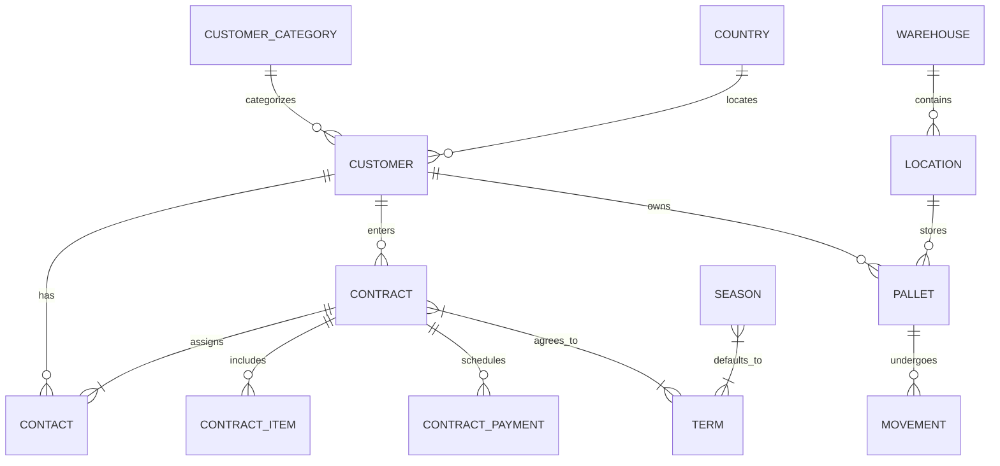

# WHMS (Warehouse Management System) - Domain, Architecture & Progress Cache

## 1. Domain Overview
The **Warehouse Management System (WHMS)** is a comprehensive enterprise web application designed to manage cold storage and warehouse logistics. It handles customer relationships, hierarchical storage locations, pallet inventory tracking, dynamic multi-season contracts, automated billing calculations, and customizable legal term libraries.

### Key Domain Concepts:
- **Seasons (المواسم)**: Temporal operational periods (e.g., DTS2026-2027). Most business operations (Contracts, Pallets, Customers) operate within the context of an active season.
- **Customers & Contacts (العملاء والمندوبين)**: Client organizations categorized hierarchically, with designated contacts who have specific legal authorities (e.g., signing contracts, withdrawing goods).
- **Contracts (العقود)**: Agreements between the warehouse and customers for storage capacity. Contracts include pricing terms, storage items, payment schedules, and dynamically generated legal preambles/terms.
- **Terms Library (مكتبة الشروط)**: A reusable repository of legal clauses supporting smart variable interpolation (e.g., `{$customer_name}`, `{$mandatory_period}`). Terms can be assigned globally, per season, or customized per contract with drag-and-drop priority sorting.
- **Warehouses & Locations (المستودعات والمواقع)**: Physical storage facilities broken down into granular hierarchical coordinates (Warehouse → Zone → Row → Slot).
- **Pallets & Movements (الطبالي وحركاتها)**: Tracking individual storage units, their dimensions, weights, current locations, and historical movement logs across the warehouse.

---

## 2. System Architecture & Tech Stack
- **Backend Framework**: Laravel 12.0 (PHP 8.2+)
- **Frontend Architecture**: Inertia.js with React 18.2
- **Styling & UI**: Tailwind CSS 3.2, Headless UI, Lucide React icons
- **Build Tool**: Vite 7.3
- **Database**: MySQL (InnoDB)

### Architectural Patterns:
- **Inertia Shared Props**: Global state (Authenticated User, Active Season ID/Name, Flash Messages) is shared via `HandleInertiaRequests` middleware.
- **Season Middleware (`EnsureSeasonIsSelected`)**: Enforces that users select an active operational season before accessing core dashboard and management routes.
- **Eloquent Fat Models & Boot Trait**: Encapsulates auto-numbering logic (e.g., Customer `s_number`, Contract `contract_number`) and date calculations directly within model `boot()` lifecycle hooks.

---

## 3. Database Schema & Models



### Detailed Table & Model Specifications:

#### `users` (App\Models\User)
- `id`, `name`, `email`, `password`, `remember_token`, `timestamps`.

#### `customers` (App\Models\Customer)
- `id`, `name`, `foreign_name`, `country_id`, `category_id`, `s_number` (Auto-generated `10014xxxxx`), `email`, `phone_number`, `website`, `vat_number`, `cr_number`, `id_number`, `status`, `address`, `timestamps`.

#### `customer_categories` (App\Models\CustomerCategory)
- `id`, `parent_id` (self-referencing), `name_ar`, `name_en`, `timestamps`.

#### `contacts` (App\Models\Contact)
- `id`, `customer_id`, `name`, `phone_number`, `id_number`, `job_title`, `can_sign` (boolean), `can_withdraw_goods` (boolean), `timestamps`.

#### `countries` (App\Models\Country)
- `id`, `name_ar`, `name_en`, `code`, `phone_code`, `timestamps`.

#### `warehouses` (App\Models\Warehouse)
- `id`, `code`, `name`, `description`, `timestamps`.

#### `locations` (App\Models\Location)
- `id`, `warehouse_id`, `code`, `zone`, `row`, `slot`, `status`, `timestamps`.

#### `pallets` (App\Models\Pallet)
- `id`, `pallet_number`, `customer_id`, `contract_id`, `location_id`, `status`, `content_description`, `weight`, `dimensions`, `timestamps`.

#### `movements` (App\Models\Movement)
- `id`, `pallet_id`, `from_location_id`, `to_location_id`, `user_id`, `reason`, `status`, `timestamps`.

#### `contracts` (App\Models\Contract)
- `id`, `customer_id`, `contact_id`, `contract_number` (Auto-generated `10015xxxxx`), `contract_date`, `write_date`, `write_date_hijri`, `start_date`, `start_date_hijri`, `end_date`, `mandatory_period` (integer, default 12), `renewal_period` (integer, default 12), `discount`, `vat_rate`, `status`, `total_capacity`, `pricing_terms`, `introduction`, `preamble`, `timestamps`.

#### `contract_items` (App\Models\ContractItem)
- `id`, `contract_id`, `storage_item_id`, `unit_count`, `monthly_rent`, `discount`, `vat_rate`, `subtotal_before_vat`, `subtotal`, `timestamps`.
- *Calculation Rule*: `subtotal` = `(unit_count * mandatory_period * monthly_rent) - discount`. `subtotal_before_vat` = `subtotal / 1.15`.

#### `contract_payments` (App\Models\ContractPayment)
- `id`, `contract_id`, `amount`, `payment_date`, `method` (enum: cash, bank_transfer, cheque), `reference`, `notes`, `timestamps`.

#### `terms` (App\Models\Term)
- `id`, `text_ar`, `text_en`, `is_active`, `has_variables`, `sort_order`, `timestamps`.

#### `contract_terms` (Pivot)
- `contract_id`, `term_id`, `sort_order`.

#### `seasons` (App\Models\Season)
- `id`, `name_ar`, `name_en`, `start_date`, `end_date`, `is_active`, `introduction`, `preamble`, `mandatory_period`, `renewal_period`, `timestamps`.

#### `season_terms` (Pivot)
- `id`, `season_id`, `term_id`, `sort_order`.

#### `contract_settings` (App\Models\ContractSetting)
- `id`, `key`, `value`, `timestamps`. (Stores global defaults like `default_introduction`, `default_mandatory_period`).

#### `agents` (App\Models\Agent) - *Legacy/Alternative*
- `id`, `name`, `phone_number`, `id_number`, `email`, `can_sign`, `can_withdraw_goods`, `is_active`, `timestamps`.

---

## 4. Core Business Logic & Workflows

### 4.1 Season Selection & Middleware Flow
1. User logs in. `EnsureSeasonIsSelected` middleware checks `session('active_season_id')`.
2. If absent, redirects to `route('season.select')` (`Auth/SelectSeason.jsx`).
3. User selects an active season. `SeasonSelectionController` stores `active_season_id` and `active_season_name` in session.
4. User accesses `route('dashboard')` and core modules.

### 4.2 Smart Variables Interpolation
When generating contracts or rendering terms, the system dynamically replaces placeholder tokens with active Eloquent model data:
- `{$customer_name}` → `Customer->name`
- `{$customer_phone}` → `Customer->phone_number`
- `{$contact_name}` → `Contact->name`
- `{$contract_number}` → `Contract->contract_number`
- `{$start_date}` → `Contract->start_date`
- `{$mandatory_period}` → `Contract->mandatory_period`
- `{$renew_period}` → `Contract->renewal_period`

### 4.3 Terms Reordering Workflow
Both Season Terms (`Settings/Seasons/Show.jsx`) and Global Terms (`Settings/ContractSettings.jsx`) support HTML5 drag-and-drop reordering. The frontend maintains an active array index and posts the reordered ID list to `seasons.terms.reorder` or `settings.terms.reorder`, updating the `sort_order` column in the database pivots.

---

## 5. Frontend Routes & Pages Structure

```
resources/js/Pages/
├── Welcome.jsx                 # Public landing page
├── Dashboard.jsx               # Main operational dashboard
├── Auth/
│   ├── Login.jsx               # Authentication
│   └── SelectSeason.jsx        # Season gateway portal
├── Customers/
│   ├── Index.jsx               # Customer directory & creation modal
│   └── Show.jsx                # Customer profile, contacts & contracts list
├── Contracts/
│   ├── Create.jsx              # Multi-step contract generation wizard
│   └── Show.jsx                # Contract printable view & details
└── Settings/
    ├── Index.jsx               # Settings main grid portal
    ├── Countries.jsx           # Country management & seeders
    ├── Categories.jsx          # Customer hierarchical categories
    ├── StorageItems.jsx        # Billable storage entities
    ├── ContractSettings.jsx    # Global terms library & default texts
    └── Seasons/
        ├── Index.jsx           # Season management grid
        └── Show.jsx            # Season-specific terms, preambles & periods
```

---

## 6. Current Implementation Status & Progress (As of May 2026)

### Completed Milestones:
1. **Database Schema Consolidation**: Fully resolved migration conflicts between `contracts`, `contacts`, `agents`, and `seasons`. All migrations execute flawlessly in sequence (`php artisan migrate:fresh --seed`).
2. **Default Seeding**:
   - `DatabaseSeeder` provisions superadmin: `admin@wms.com` / `admin123`.
   - `CountrySeeder`, `CustomerCategorySeeder`, `PalletSeeder`, and `SeasonSeeder` populate base operational data.
3. **Frontend Asset Integrity**: Fixed all JSX syntax errors (unclosed tags, duplicate blocks) in `Seasons/Show.jsx` and `ContractSettings.jsx`.
4. **Production Build & Design System Integration**: 
   - Successfully compiled frontend bundles via `npm run build` using Vite 7.3.
   - Applied CSS-variable-based dynamic thematic configurations (5 colors, 4 backgrounds, 5 Arabic fonts) without requiring recompilations.
   - Configured zeroed border radius (`borderRadius: 0px`) globally via Tailwind config for complete sharp-corner layouts.
   - Redesigned Topbar (language switcher & breadcrumbs) and Sidebar (Brand header, exclusive accordion, and theme picker pane).
   - Enforced maximum 8px vertical spacing across the layout.
5. **Interactive Custom Modals & Secure Deletions**:
   - Implemented `ConfirmationModal.jsx` to replace browser default confirms.
   - Enforced server-side user password checks via `DeleteResourceRequest` for all deletions (e.g., customers).
6. **Central & Tenant Configuration Database**:
   - Migrated and created `admin_settings` and `tenant_settings` schemas.
   - Developed `SettingsService` helper and standardized JSON api responses.

### التحديثات الموثقة (23 مايو 2026):
* **تحديث نظام المظهر والشكل:** تم تصفير جميع حواف العناصر بنجاح لتصبح حادة بالكامل (`borderRadius: 0px`).
* **تعديل الهيكل العام:** تقليص التباعد الرأسي للهوامش ليكون 8 بكسل كحد أقصى، نقل مبدل اللغة للشريط العلوي، وتطوير أكورديون القوائم الحصري في الشريط الجانبي.
* **الأمان والتفاعل:** استبدال تأكيدات المتصفح الافتراضية بنوافذ تأكيد تفاعلية مخصصة (`ConfirmationModal`) مع إلزامية التحقق من كلمة مرور المستخدم الجاري عبر السيرفر قبل إتمام عمليات الحذف الحساسة.
* **البناء والتكامل:** تشغيل جميع عمليات هجرة قاعدة البيانات وبناء ملفات الإنتاج بنجاح كامل وخلو الفرونت اند من أي أخطاء تجميع.

### Next Steps / Potential Agent Tasks:
- Implementing dynamic PDF generation/printing for `Contracts/Show.jsx`.
- Expanding QR/Barcode scanning integration for `Pallets` and `Movements`.
- Developing advanced filtering and reporting dashboards for active season warehouse capacity.
